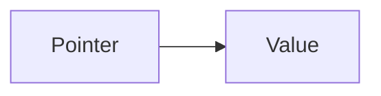

# Pointers

[toc]

```c
sizeof(char)=1
sizeof(short)
sizeof(int)= 4 (32 bit) or 8 (32bit)
sizeof(long)
sizeof(float)
sizeof(double)
sizeof(longdouble)
```

### Example in memory
```c
struct student{
  int id;
  char a;
  int id2;
  char b;
  float percentage
}
```

In memory:

. |1 byte|1 byte|1 byte|1 byte|
:-:|:-:|:-:|:-:|:-:|
id|x|x|x|x||
a|x|||||
id2|x|x|x|x||
b|x|||||
precentage|x|x|x|x||

## Pointers 
Pointers are varibles whose values are memory addresses 

- The address operator, *
  - Returns the value of the object to which its operand (i.e., a pointer) points  
  - ```*p = v = 5``` because it's openrand ```p``` points to ```v```
- The indirection operator, &
  - Given a variable, it takes its address
  - Given ```*p = v = 5```  ```&v``` is the address of ```v```

```c
<type> *<pointer>;
int *pointer;
int number;

pointer = &number;
```
> This means that the pointer is equal to the number address, so pointer points to the number

### All possible cases
```c
#include <stdio.h>
#include <stdlib.h>

int main(int argc, char *argv[])
{
  int v = 5;
  int *p;
  p = &v;

  printf("%d\n", v);
  /** printf("%d\n", *v); Error!*/
  printf("%d\n", &v);
  printf("%d\n", p);
  printf("%d\n", *p);
  printf("%d\n", &p);
  printf("%d\n", *(&v));
  /** printf("%d\n", &(*v)); Error!*/
  printf("%d\n", *(&p));
  printf("%d\n", &(*p));

  return 0;
}
```
```
5
//Error!
957891628
957891628
5
957891616
5
//Error!
957891628
957891628
```

Simbol|Meaning|Outcome
:-:|:-:|:-:|
v|integer value|5
*v|meaningless|Error*!
&v|Address of v|Warning*! address 957891628
p|It is the address of v that points to v|Warning! address 957891628
*p|It's where p points. So it's the int value v|5
&p|p|Warning*! address 957891628
*(&v)|v (integer value)|5
&(*v)|meaningless|Error!
*(&p)|p|Warning*! address 957891628
&(*p)|p|Warning*! address 957891628

>*The Warning is because the print is going to print an integer ("%d") but the
>simbol is the integer address

## Final version with no Errors and no Warnings

```c
#include <stdio.h>
#include <stdlib.h>

int main(int argc, char *argv[])
{
  int v = 5;
  int *p;
  p = &v;

  printf("%d\n", v);
  printf("%lu\n", (long unsigned int) &v);
  printf("%lu\n", (long unsigned int) &v);
  printf("%lu\n", (long unsigned int) p);
  printf("%d\n", *p);
  printf("%lu\n", (long unsigned int) &p);
  printf("%d\n", *(&v));
  printf("%lu\n", (long unsigned int) *(&p));
  printf("%lu\n", (long unsigned int) &(*p));

  return 0;
}
```
Run:
```
5
140735223946540
140735223946540
140735223946540
5
140735223946528
5
140735223946540
140735223946540
```

Simbol|Meaning|Outcome
:-:|:-:|:-:|
v|integer value|5
&v|Address of v|Address 140735223946540
p|It is the address of v that points to v|Address 140735223946540
*p|It's where p points. So it's the int value v|5
&p|p|Address 140735223946540
*(&v)|v (integer value)|5
*(&p)|p|Address 140735223946540
&(*p)|p|Address 140735223946540



```mermaid
graph LR
  p=&v=140735223946540 --> *p=v=5
```
> ```p``` is the pointer that points to ```v = 5``` (```*p``` means pointed by ```p```) whose address is ```p = &v = 140735223946540```

---
### Example
```c
#include <stdio.h>
#include <stdlib.h>

int main(int argc, char *argv[])
{
  float *ptr;
  float f = 7.5;

  int *ppp;
  int a = 3;

  ptr = &f;
  ppp = &a;

  printf("%.2f\n%.2f\n", f, *ptr); 
  printf("%d\n%d\n%d\n", &a, &(*ppp), ppp); 

  return 0;
}
```
Run:
```
7.5
7.5
32324325525
32324325525
32324325525
```

#### void pointer
```c
int i, j;
void *pv;
...
pv = &i;
...
j = *pv;
```

```
j = i;
```
```c
int i, j;
void *pv;
...
pv = (void *) &i;
...
j = (int) *pv;
```

```
j = i;
```
## Pointer Arithmetic
```c
int i = 10;
int *p1;
int *p2;

p1 = &i;
p1++;
```
```p++``` makes the pointer points to next < type >, basically if int p++ means
next byte, if char, next bit...

```C
int i = 10;
int j = 20;
int *p1;
int *p2;
p1 = &i;
p2 = &j;
if (*p1 == *p2) { *1... }
if (p1 == p2) { *2... }
if (p1 > p2) { *3... }
```
- *1 Check whether the referenced values are the
same even if they are placed in different
position within the system memory

- *2 Check whether the two pointers
refer to the same object, i.e., they
store the same memory address

- *3 Check whether the address p1 comes
after the address p2 into the system
memory; this is often meaningless
If p1==p2 also *p1==*p2

## By reference
### Wrong
```C
int i; j;

swap (i, j);
```
Here you change them locally only
```C
void swap (int x, int y) {
  int tmp;
  
  tmp = x;
  x = y;
  y = tmp;

  return;
}
```
### Correct
```C
int i; j;

swap (&i, &j);
```
Here you pass the address
```C
void swap (int *x, int *y) {
  int tmp;
  
  tmp = *x;
  *x = *y;
  *y = tmp;

  return;
}
```
